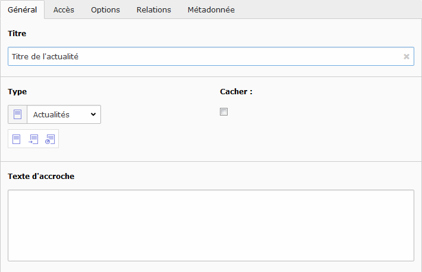

# Éditer une actualité

Pour éditer une actualité :

* Sélectionner le mode **Gestion des Actualités** dans la [Liste des modules](../premiers-pas/se-reperer-dans-le-backend.md) ;
* Cliquer sur l'icône  de l'actualité cible dans la [Vue détaillée](../premiers-pas/se-reperer-dans-le-backend.md) puis **Éditer**.

En haut de la vue détaillée, différentes actions sont proposées :

 annuler les modifications et retourner à la vue générale des actualités ;

 enregistrer les modifications ;

 supprimer l'actualité.

## Général

**Titre** : définit un titre pour l'actualité ;

**Type** : modifie le type de l'actualité, lien vers une page interne ou externe \(vers un autre site\) ;

**Cacher** : cache l'actualité aux internautes ;

**Texte d'accroche** : résumé affiché dans la liste des actualités ;

**Nom de l'auteur** : définit un auteur de l'actualité \(affiché en fonction des sites\) ;

**Courriel de l'auteur** : définit un email disponible en lien sur le nom de l'auteur ;

**Date et heure** : date de l'enregistrement de l'actualité ;

**Archives** : date d'archivage de l'actualité ;

**Editeur RTE** : contenu de l'actualité.

## Accès

**Date de publication** : date de publication de l'actualité ;

**Date d'explication** : date d'expiration de l'actualité, après cette date, l'actualité sera cachée ;

## Relations

**Fichier média** : lier une vidéo **youtube** ou **vimeo** à l'actualité ;

**Fichiers en relation** : lier une **image** à l'actualité ;

**Liens en relation** : lier un **lien externe** ou interne à l'actualité ;

## Métadonnée

**Mots-clés** : liste des mots-clés associés à l'actualité \(**non pris en compte par les moteurs de recherche**\), séparés par des virgules ;

**Description** : texte associé à l'actualité affiché par les moteurs de recherche.

