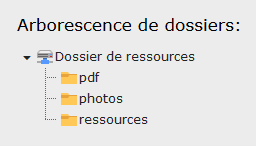
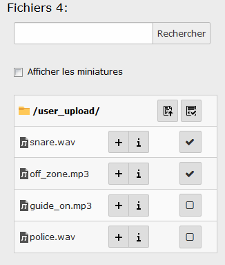
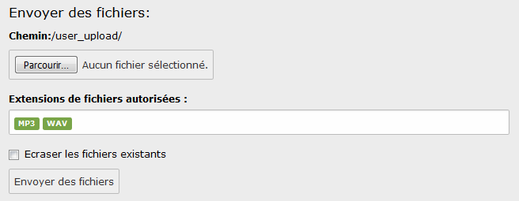
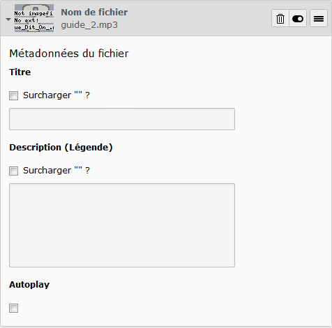

# Audio

A partir de la liste vue dans [Créer un élément de contenu](../creer-un-element-de-contenu.md), sélectionner :

> **Note :** Comme dans la plupart des types de contenu, il est possible de renseigner un **Titre**. Pour plus d'informations, se référer à la fiche de l'élément [Titre](titre.md).

Un onglet **Média** est disponible, il permet d'ajouter un fichier audio **mp3** ou **wav**.

## Media elements

Cette zone permet d'ajouter un ou plusieurs fichiers audio.

Pour ajouter un ou plusieurs fichiers audio, cliquer sur le bouton **Créer une nouvelle relation**.

Une nouvelle fenêtre s'ouvre, articulée en deux colonnes, elle permet d'effectuer une sélection d'un ou plusieurs fichiers audio.

La colonne de gauche présente l'arborescence du dossier des ressources \(voir [Gestion des fichiers](https://www.gitbook.com/book/agrosup-dijon-eduter/guide-utilisation-typo3/edit#)\), sélectionner le répertoire contenant la ou les fichiers à insérer.

La colonne de droite s'actualise avec la liste des fichiers audio présents dans le répertoire choisi.

 Fichier non sélectionné

 Fichier sélectionné

 Importer la sélection

Sélectionner les images désirées et cliquer sur l'icône **Importer la sélection**.

Si le fichier n'existe pas dans le répertoire des ressources, il faut alors le télécharger depuis le poste utilisateur.

En bas de la fenêtre se trouve la zone **Envoyer des fichiers**. Cliquer sur **Parcourir** pour sélectionner les fichiers audio depuis le poste utilisateur. Cliquer sur **Envoyer des fichier** pour télécharger les fichiers dans le répertoire sélectionné dans la colonne arborescence du dossier des ressources.

> **Note :**
>
> 
>
> Il est possible d'ajouter directement un ou plusieurs fichier audio depuis le poste utilisateur, cliquer sur le bouton **Sélectionner et transférer des fichiers**.
>
> Une nouvelle fenêtre \(en fonction du système d'exploitation de l'utilisateur\) pour la sélection du fichier s'affiche. Le fichier audio est ainsi téléchargé sur le serveur, dans le dossier des ressources \(voir [Gestion des fichiers](https://www.gitbook.com/book/agrosup-dijon-eduter/guide-utilisation-typo3/edit#)\).

Une fois les fichiers audio importés, ils s'affichent par ordre d'apparition et peuvent être modifiés :

 supprimer le fichier du contenu \(ne le supprime pas du dossier de ressource\) ;

 cacher/afficher le fichier audio ;

 sélectionner le fichier pour changer l'ordre d'apparition par glisser/déposer :

Cliquer sur **Nom de fichier** pour éditer les informations relatives au fichier ou l'éditer :

**Titre :** ajouter un titre ;

**Description :** ajouter un texte associé ;

**Autoplay :** lit automatiquement le fichier à l'affichage de la page.

