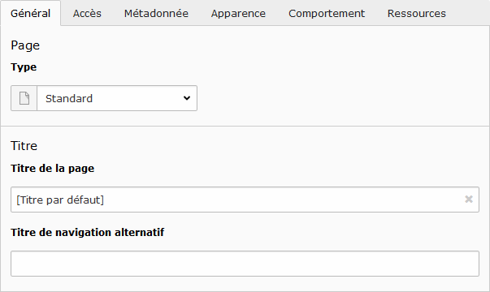

# Éditer une page

Pour éditer une page :

* Sélectionner le mode **Page** dans la [Liste des modules](../prise-en-main/se-reperer-dans-le-backend.md) ;
* Cliquer sur la page à modifier dans l'[Arborescence](../prise-en-main/se-reperer-dans-le-backend.md);
* Cliquer sur l’icône  **Modifier les propriétés de la page** dans la [Vue détaillée](../prise-en-main/se-reperer-dans-le-backend.md).

En haut de la vue détaillée, différentes actions sont proposées :

* Fermer et retourner à la vue générale de la page ;
* Enregistrer les modifications ;
* Voir les modifications dans un nouvel onglet ;
* Créer un nouvelle page au même niveau que la page courante ;
* Supprimer la page.



**Type** : permet de changer le type de la page \(voir [Créer une page](creer-une-page.md)\) ;

**Titre de la page** : permet de définir un titre pour la page ;

**Titre de navigation alternatif** : permet de définir un titre affiché dans le menu du site pour la page. Par défaut, le titre de la page est utilisé.



**Page** : active ou non la visibilité de la page aux internautes ;

**Dans les menus** : cache ou non la page dans les menus.



**Mots-clés** : liste des mots-clés associés à la page \(**non pris en compte par les moteurs de recherche**\), séparés par des virgules ;

**Description** : texte associé à la page affiché par les moteurs de recherche.



**Gabarit Frontend** : permet de changer la déclinaison \(généralement la couleur\) de la charte graphique pour la page et ses sous-pages \(si non définie\) ;

**Gabarit Backend \(seulement cette page\)** : permet de changer la charte graphique pour la page ;

**Gabarit Backend \(sous-page de cette page\)** : permet de changer la charte graphique des sous-pages \(si non définie\).

**Vignette**



**Média** : permet d'associer une ou plusieurs images à la page, s'affiche généralement sous forme de bandeau simple ou défilant \(slideshow\) si plusieurs images. Voir la partie [Gestion des fichiers](../gestion-des-fichiers-1/generalites-fichiers.md) pour ajouter des images.



