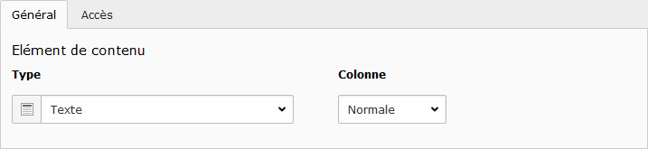
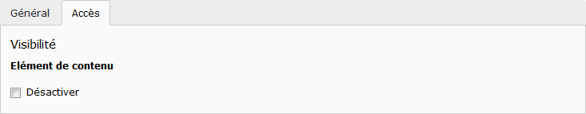

# Types de contenu

Chaque élément de contenu possède une section commune pour tous. Après avoir sélectionné un type de contenu dans la partie [Créer un élément de contenu](../creer-un-element-de-contenu.md), différents onglets s'affichent :

Dans l'onglet **Général**, il est possible de modifier le **Type** du contenu choisi et de sélectionner la zone d'affichage avec le champ Colonne \(en fonction de la charte graphique du site\).


Si le type de l'élément est modifié \(exemple : **Texte** en **Texte + Image**\), un nouvel onglet **Média** est ajouté. 

A l'inverse, si on passe par exemple d'un type **Texte + Image** à un type **Texte**, l'onglet **Média** disparaît \(mais les données sont toujours stockées et si on revient à **Texte + Image**, elles réapparaissent\).


L'onglet **Accès** permet de définir la visibilité du contenu, sélectionner **Désactiver** pour qu'il ne soit plus visible par les internautes.


Une multitude de types de contenus spnt disponibles, certains ne sont pas détaillés dans ce guide mais suivent la même logique d'ajout.


