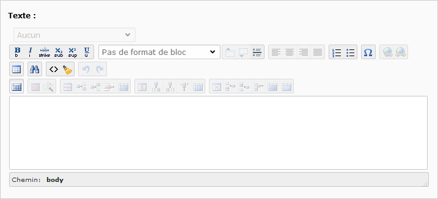

# Texte

A partir de la liste vue dans [Créer un élément de contenu](../creer-un-element-de-contenu.md), sélectionner :

> **Note :** Comme dans la plupart des types de contenu, il est possible de renseigner un **Titre**. Pour plus d'informations, se référer à la fiche de l'élément [Titre](titre.md).

La zone **Texte** comporte un éditeur de texte spécifique \(appelé RTE : Rich Text Editor ou Éditeur de texte avancé\). Il permet de mettre en forme le texte sans avoir besoin de connaissances en langage html. On retrouve les grandes lignes d'un traitement de texte classique.

Une brève description de chaque fonctionnalité apparaît en positionnant la souris sur chacune des icônes.

> **Note :** L'éditeur ne possède pas de sauvegarde automatique. Il est donc conseillé de sauvegarder régulièrement les travaux.

